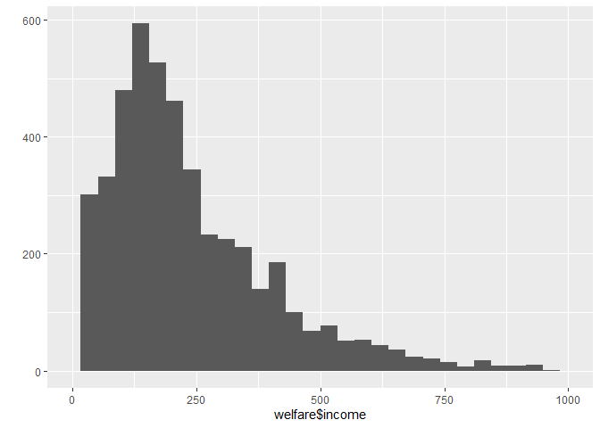

성별에 따른 월급 차이
================
박세화
July 30, 2020

## 2\. 성별에 따른 월급 차이

데이터 분석을 통해 성별에 따라 월급 차이가 있는지 알아본다. 먼저 성별과 월급 두 변수를 검토하고 전처리한 뒤 변수 간의 관계를
분석한다.

### 분석 절차

1.  1단계 : 변수 검토 및 전처리 (성별, 월급)
2.  2단계 : 변수 간 관계 분석 (성별 월급 평균표 만들기, 그래프 만들기)

### 성별 변수 검토 및 전처리

#### 1\. 변수 검토하기

``` r
class(welfare$sex)
table(welfare$sex)
```

#### 2\. 전처리

데이터에 이상치가 있는지 검토하고, 분석에서 이상치를 제외할 수 있도록 NA를 부여한다.

``` r
table(welfare$sex)     # 이상치 확인
```

#### 이상치 결측 처리 및 확인

``` r
welfare$sex <- ifelse(welfare$sex==9,NA,welfare$sex)  # 이상치 결측 처리
table(is.na(welfare$sex))                             # 결측치 확인
```

    ## 
    ## FALSE 
    ## 16664

값의 의미를 이해하기 쉽도록 문자 “male”과 “female”로 바꾸고 table(), qplot()을 이용해 바꾼 값이
반영됐는지 출력 결과를 확인한다.

``` r
welfare$sex <- ifelse(welfare$sex==1,"male","female")
table(welfare$sex)
```

    ## 
    ## female   male 
    ##   9086   7578

``` r
qplot(welfare$sex)
```

<!-- -->

### 월급 변수 검토 및 전처리

#### 1\. 변수 검토하기

월급 변수를 검토하기 위해 summary()로 요약 통계량을 확인한다.

``` r
class(welfare$income)
summary(welfare$income)
```

qplot()으로 분포를 확인하고, 확인하기 쉽도록 범위를 조정해준다.

``` r
qplot(welfare$income)+xlim(0,1000)
```

<!-- -->

#### 2\. 전처리

``` r
summary(welfare$income)     # 이상치 확인
```

    ##    Min. 1st Qu.  Median    Mean 3rd Qu.    Max.    NA's 
    ##     0.0   122.0   192.5   241.6   316.6  2400.0   12030

코드북을 참고하여 값이 0이거나 9999인 경우 결측처리한다.

``` r
welfare$income <- ifelse(welfare$income %in% c(0,9999),NA,welfare$income)  # 이상치 결측 처리
table(is.na(welfare$income))                                               # 이상치 결측 확인
```

### 성별에 따른 월급 차이 분석하기

#### 1\. 성별 월급 평균표 만들기

성별 월급 평균표를 만들어 비교해본다.

``` r
sex_income <- welfare %>% 
  filter(!is.na(income)) %>% 
  group_by(sex) %>% 
  summarise(mean_income=mean(income))
```

    ## `summarise()` ungrouping output (override with `.groups` argument)

#### 2\. 그래프 만들기

``` r
ggplot(data=sex_income,aes(x=sex,y=mean_income))+geom_col()
```

<!-- -->
