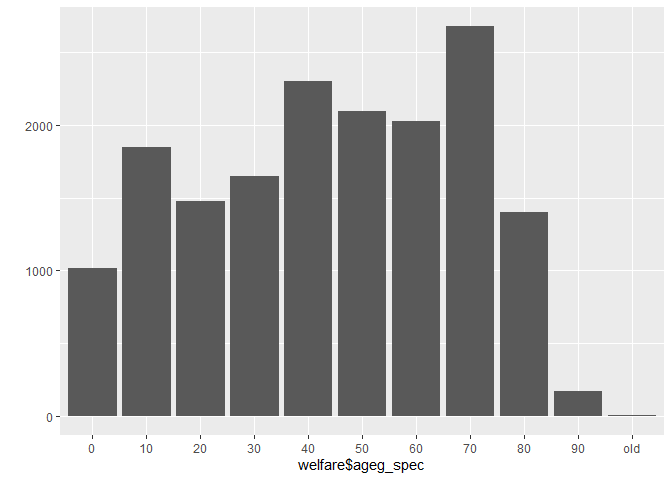
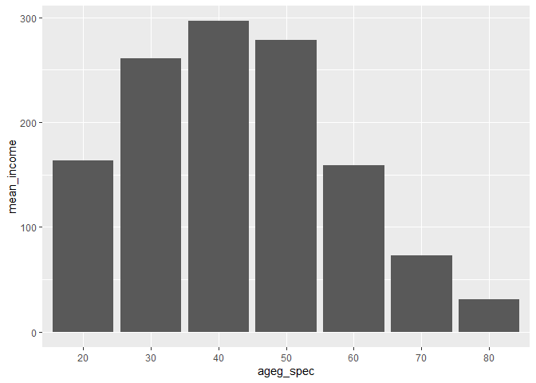

연령대에 따른 월급 차이
================
박세화
July 31, 2020

## 4\. 연령대에 따른 월급 차이

나이를 연령대로 분류해서 비교한다.

### 분석 절차

  - 1단계 : 변수 검토 및 전처리 (연령대, 월급)
  - 2단계: 변수 간 관계 분석 (연령대별 월급 평균표 만들기, 그래프 만들기)

### 연령대 변수 검토 및 전처리하기

#### 1\. 파생변수 만들기 - 연령대

초년은 30세 미만, 중년은 30\~59세, 노년은 60세 이상으로 기준을 정하고, 이에 따라 연령대 변수를 만든 후 각 범주에
몇 명이 있는지 살펴본다.

``` r
welfare <- welfare %>% 
  mutate(ageg=ifelse(age<30,"young",ifelse(age<60,"middle","old")))

table(welfare$ageg)
```

    ## 
    ## middle    old  young 
    ##   6049   6281   4334

``` r
qplot(welfare$ageg)
```

<!-- -->

### 연령대에 따른 월급 차이 분석하기

변수 간 관계를 분석한다.

#### 1\. 연령대별 월급 평균표 만들기

``` r
ageg_income <- welfare %>% 
  filter(!is.na(income)) %>% 
  group_by(ageg) %>% 
  summarise(mean_income=mean(income))
```

    ## `summarise()` ungrouping output (override with `.groups` argument)

``` r
ageg_income
```

    ## # A tibble: 3 x 2
    ##   ageg   mean_income
    ##   <chr>        <dbl>
    ## 1 middle        281.
    ## 2 old           125.
    ## 3 young         164.

#### 2\. 그래프 만들기

연령대별 월급 평균표를 이용해 그래프를 만든다.

``` r
ggplot(data=ageg_income,aes(x=ageg,y=mean_income))+geom_col()
```

<!-- -->

#### 막대 정렬 : 초년, 중년, 노년 나이 순

ggplot()을 이용한 상위 그래프는 변수의 알파벳 순으로 자동 정렬되므로, 막대가 초년(young), 중년(middle),
노년(old) 순으로 재정렬되도록 설정한다.

``` r
ggplot(data=ageg_income,aes(x=ageg,y=mean_income))+
  geom_col()+
  scale_x_discrete(limits=c("young","middle","old"))
```

<!-- -->

위와 같은 분석을 통해 중년이 평균 281만원으로 가장 많은 월급을 받고, 초년이 164만원, 노년이 125만원 순으로 월급을
받는 것을 알 수 있다.

### 연령대 세부적으로 분석해보기

#### 1\. 파생변수 만들기 - 연령대

연령대를 세부적으로 구분하기 위해 태어난 년도 변수의 상세 사항을 확인한다.

``` r
summary(welfare$birth)
```

    ##    Min. 1st Qu.  Median    Mean 3rd Qu.    Max. 
    ##    1907    1946    1966    1968    1988    2014

가장 연령이 높은 사람이 1907년생으로 100세 이상이고, 가장 어린 연령이 2014년 생으로 2살이므로 0부터 100까지
10단위로 연령을 구분한다.

``` r
welfare <- welfare %>% 
  mutate(ageg_spec=ifelse(age<10,"0",ifelse(age<20,"10",ifelse(age<30,"20",ifelse(age<40,"30",ifelse(age<50,"40",ifelse(age<60,"50",ifelse(age<70,"60",ifelse(age<80,"70",ifelse(age<90,"80",ifelse(age<100,"90","old")))))))))))

table(welfare$ageg_spec)
```

    ## 
    ##    0   10   20   30   40   50   60   70   80   90  old 
    ## 1015 1846 1473 1647 2305 2097 2028 2679 1398  172    4

``` r
qplot(welfare$ageg_spec)
```

<!-- -->

### 연령대에 따른 월급 차이 분석하기

#### 1\. 연령대별 평균 월급표 만들기

``` r
ageg_spec_income <- welfare %>% 
  filter(!is.na(income)) %>% 
  group_by(ageg_spec) %>% 
  summarise(mean_income=mean(income))
```

    ## `summarise()` ungrouping output (override with `.groups` argument)

``` r
ageg_spec_income
```

    ## # A tibble: 7 x 2
    ##   ageg_spec mean_income
    ##   <chr>           <dbl>
    ## 1 20              164. 
    ## 2 30              261. 
    ## 3 40              297. 
    ## 4 50              279. 
    ## 5 60              159. 
    ## 6 70               73.0
    ## 7 80               30.9

#### 2\. 그래프 만들기

``` r
ggplot(data=ageg_spec_income,aes(x=ageg_spec,y=mean_income))+geom_col()
```

<!-- -->

표와 그래프를 통해 10단위로 분리한 연령대 중, 0,10,90,100대의 사람들은 소득이 없다는 것을 알 수 있다. 또한
그래프를 통해 20대부터 시작하여 40대까지는 소득이 증가하지만, 이후에는 지속적으로 소득이 감소하는 경향을 볼 수
있다.
