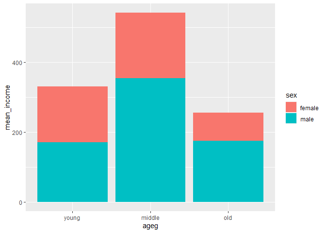
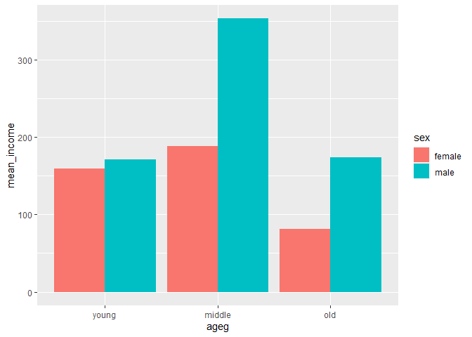
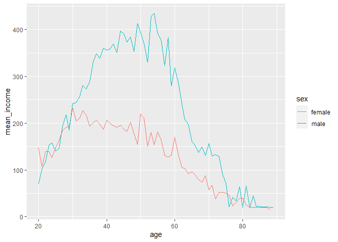

연령대 및 성별 월급 차이
================
박세화
July 31, 2020

## 5\. 연령대 및 성별 월급 차이

성별 월급 차이가 연령대에 따라 다른지 분석한다.

### 분석 절차

  - 1단계 : 변수 검토 및 전처리 (연령대, 성별, 월급)
  - 2단계 : 변수 간 관계 분석 (연령대 및 성별 월급 평균표 만들기, 그래프 만들기)

### 연령대 및 성별 월급 차이 분석하기

#### 1\. 연령대 및 성별 월급 평균표 만들기

각 연령대에서 성별에 따른 월급 차이가 있는지 알아보기 위해 연령대 및 성별에 따른 월급 평균표를 만든다.

``` r
ageg_sex_income <- welfare %>% 
  filter(!is.na(income)) %>% 
  group_by(ageg,sex) %>% 
  summarise(mean_income=mean(income))
```

    ## `summarise()` regrouping output by 'ageg' (override with `.groups` argument)

``` r
ageg_sex_income
```

    ## # A tibble: 6 x 3
    ## # Groups:   ageg [3]
    ##   ageg   sex    mean_income
    ##   <chr>  <chr>        <dbl>
    ## 1 middle female       188. 
    ## 2 middle male         353. 
    ## 3 old    female        81.5
    ## 4 old    male         174. 
    ## 5 young  female       160. 
    ## 6 young  male         171.

#### 2\. 그래프 만들기

``` r
ggplot(data=ageg_sex_income,aes(x=ageg,y=mean_income,fill=sex))+
  geom_col()+
  scale_x_discrete(limits=c("young","middle","old"))
```

<!-- -->

#### 성별 막대 분리

상위 그래프는 각 성별의 월급이 막대에 함께 표현되어 있어 차이를 명확히 비교하기 어렵기 때문에 막대를 분리한다.

``` r
ggplot(data=ageg_sex_income,aes(x=ageg,y=mean_income,fill=sex))+
  geom_col(position="dodge")+
  scale_x_discrete(limits=c("young","middle","old"))
```

<!-- -->

표와 그래프를통해 연령대별로 성별에 따른 월급이 차이가 있다는 것을 알 수 있다. 초년은 다소 차이가 크지 않지만, 중년으로
진입하며 남성이 여성의 약 2배 정도의 월급을 받게 된다. 노년에는 이 차이가 다소 줄어들지만 여전히 남성이 여성보다
약 2배의 월급을 받는다.

또한 남성의 경우 중년에 가장 많은 월급을 받고 초년과 노년의 경우에는 그 차이가 크지 않다. 반면, 여성의 경우 중년에 가장
많은 월급을 받긴 하지만 초년의 월급과 그 차이가 크지 않고, 노년이 되면 초년의 1/2도 되지 않는 월급밖에 수령하지
못한다는 것을 알 수 있다.

### 나이 및 성별 월급 차이 분석하기

이번에는 연령대로 구분하지 않고 나이 및 성별 월급 평균표를 만들고 이를 시계열 그래프로 표현해보도록 한다.

#### 그래프 만들기

``` r
sex_age <- welfare %>% 
  filter(!is.na(income)) %>% 
  group_by(age,sex) %>% 
  summarise(mean_income=mean(income))     # 성별 연령별 월급 평균표 만들기
```

    ## `summarise()` regrouping output by 'age' (override with `.groups` argument)

``` r
head(sex_age)
```

    ## # A tibble: 6 x 3
    ## # Groups:   age [3]
    ##     age sex    mean_income
    ##   <dbl> <chr>        <dbl>
    ## 1    20 female        147.
    ## 2    20 male           69 
    ## 3    21 female        107.
    ## 4    21 male          102.
    ## 5    22 female        140.
    ## 6    22 male          118.

``` r
ggplot(data=sex_age,aes(x=age,y=mean_income,col=sex))+geom_line()
```

<!-- -->

그래프를 통해 남성의 경우 50대 중반까지 월급이 증가하는 경향을 보이다가 이후 60대 중반까지 급격히 감소하고 70대 중반
이후에는 일정하게 유지되는 형태를 확인할 수 있다. 여성의 경우는 30대까지 월급이 증가하다가 30대부터 50대까지는
비교적 월급이 유지되는 경향을 보이고, 이후에는 월급이 지속적으로 감소하는 모습을 보인다. 성별 임금 격차는 30대까지는
차이를 보이지 않지만 이후 지속적으로 벌어져 50대에 가장 큰 차이를 보이고, 이후 점차 줄어들어 70대 중반부터는
다시 비슷한 수준이 되는 것을 확인할 수 있다.
