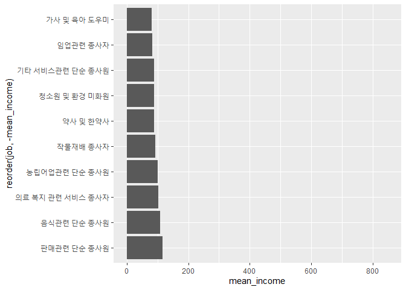

직업별 월급 차이
================
박세화
July 31, 2020

## 6\. 직업별 월급 차이

직업별 월급 차이 분석을 위해 직업 변수를 검토하고 전처리한다.

### 분석 절차

  - 1단계 : 변수 검토 및 전처리 (직업, 월급)
  - 2단계 : 변수 간 관계 분석 (직업별 월급 평균표 만들기, 그래프 만들기)

### 직업 변수 검토 및 전처리하기

#### 1\. 변수 검토하기

직업을 나타낸 code\_job 변수를 살펴본다.

``` r
class(welfare$code_job)

table(welfare$code_job)
```

#### 2\. 전처리

직업분류코드 목록을 이용해 숫자로 되어 있는 code\_job 변수를 직업의 명칭으로 된 변수로 만든다.
Koweps\_Codebook.xlsx를 이용해 첫 행을 변수명으로 가져오도록 설정하고, 엑셀 파일의 두 번째 시트에 있는
직업분류코드 목록을 불러온다.

``` r
list_job <- read_excel("Koweps_Codebook.xlsx",col_names = T,sheet = 2)

head(list_job)
```

    ## # A tibble: 6 x 2
    ##   code_job job                                
    ##      <dbl> <chr>                              
    ## 1      111 의회의원 고위공무원 및 공공단체임원
    ## 2      112 기업고위임원                       
    ## 3      120 행정 및 경영지원 관리자            
    ## 4      131 연구 교육 및 법률 관련 관리자      
    ## 5      132 보험 및 금융 관리자                
    ## 6      133 보건 및 사회복지 관련 관리자

``` r
dim(list_job)
```

    ## [1] 149   2

이를 통해 직업 명칭으로 된 list\_job 변수를 생성하고, 직업이 149개로 분류된다는 것을 확인했다.

#### 3\. data frame 결합하기

left\_join()으로 job 변수를 welfare에 code\_job을 기준으로 결합한다.

``` r
welfare <- left_join(welfare,list_job,id="code_job")
```

    ## Joining, by = "code_job"

``` r
welfare %>% 
  filter(!is.na(code_job)) %>% 
  select(code_job,job) %>% 
  head(10)
```

    ##    code_job                                job
    ## 1       942                   경비원 및 검표원
    ## 2       762                             전기공
    ## 3       530 방문 노점 및 통신 판매 관련 종사자
    ## 4       999        기타 서비스관련 단순 종사원
    ## 5       312                    경영관련 사무원
    ## 6       254             문리 기술 및 예능 강사
    ## 7       510                        영업 종사자
    ## 8       530 방문 노점 및 통신 판매 관련 종사자
    ## 9       286   스포츠 및 레크레이션 관련 전문가
    ## 10      521                   매장 판매 종사자

### 직업별 월급 차이 분석하기

#### 1\. 직업별 월급 평균표 만들기

직업이나 월급이 없는 사람은 분석 대상이 아니므로 제외하고 직업별 월급 평균을 구한다.

``` r
job_income <- welfare %>% 
  filter(!is.na(job)&!is.na(income)) %>% 
  group_by(job) %>% 
  summarise(mean_income=mean(income))
```

    ## `summarise()` ungrouping output (override with `.groups` argument)

``` r
head(job_income)
```

    ## # A tibble: 6 x 2
    ##   job                           mean_income
    ##   <chr>                               <dbl>
    ## 1 가사 및 육아 도우미                  80.2
    ## 2 간호사                              241. 
    ## 3 건설 및 광업 단순 종사원            190. 
    ## 4 건설 및 채굴 기계운전원             358. 
    ## 5 건설 전기 및 생산 관련 관리자       536. 
    ## 6 건설관련 기능 종사자                247.

#### 2\. 상위 10개 추출

어떤 직업의 월급이 많은지 알아보기 쉽도록 월급을 내림차순으로 정렬하고 상위 10개를 추출한다.

``` r
top10 <- job_income %>% 
  arrange(desc(mean_income)) %>% 
  head(10)

top10
```

    ## # A tibble: 10 x 2
    ##    job                                  mean_income
    ##    <chr>                                      <dbl>
    ##  1 금속 재료 공학 기술자 및 시험원             845.
    ##  2 의료진료 전문가                             844.
    ##  3 의회의원 고위공무원 및 공공단체임원         750 
    ##  4 보험 및 금융 관리자                         726.
    ##  5 제관원 및 판금원                            572.
    ##  6 행정 및 경영지원 관리자                     564.
    ##  7 문화 예술 디자인 및 영상 관련 관리자        557.
    ##  8 연구 교육 및 법률 관련 관리자               550.
    ##  9 건설 전기 및 생산 관련 관리자               536.
    ## 10 석유 및 화학물 가공장치 조작원              532.

#### 3\. 그래프 만들기

표를 이용해 월급 상위 10개 직업 그래프를 만든다. 직업 이름이 길기 때문에 막대를 오른쪽으로 90도 회전시킨 그래프를 만든다.

``` r
ggplot(data=top10,aes(x=reorder(job,mean_income),y=mean_income))+
  geom_col()+
  coord_flip()
```

<!-- -->

표와 그래프를 통해 ’금속 재료 공학 기술자 및 시험원’이 평균 845만원으로 가장 많은 월급을 받고, 다음으로 ’의로진료
전문가’가 평균 844만원, ’의회의원 고위공무원 및 공공단체임원’이 평균 750만원으로 많은 월급을 받고 있음을
알 수 있다.

#### 4\. 하위 10위 추출

이번에는 반대로 어떤 직업이 월급이 적은지 알아보기 위해 월급을 오름차순으로 정렬하여 하위 10개를 추출한다.

``` r
bottom10 <- job_income %>% 
  arrange(mean_income) %>% 
  head(10)

bottom10
```

    ## # A tibble: 10 x 2
    ##    job                          mean_income
    ##    <chr>                              <dbl>
    ##  1 가사 및 육아 도우미                 80.2
    ##  2 임업관련 종사자                     83.3
    ##  3 기타 서비스관련 단순 종사원         88.2
    ##  4 청소원 및 환경 미화원               88.8
    ##  5 약사 및 한약사                      89  
    ##  6 작물재배 종사자                     92  
    ##  7 농립어업관련 단순 종사원           102. 
    ##  8 의료 복지 관련 서비스 종사자       104. 
    ##  9 음식관련 단순 종사원               108. 
    ## 10 판매관련 단순 종사원               117.

#### 5\. 그래프 만들기

표를 이용해 월급 하위 10개 직업 그래프를 만든다. 월급 상위 10개 직업 그래프와 마찬가지로 직업 이름이 길기 때문에 막대를
오른쪽으로 90도 회전시킨 그래프를 만든다. 월급 상위 10개 직업 그래프와 함께 살펴볼 수 있도록 y축의 범위를 0부터
850까지로 조정한다.

``` r
ggplot(data=bottom10,aes(x=reorder(job,-mean_income),y=mean_income))+
  geom_col()+
  coord_flip()+
  ylim(0,850)
```

<!-- -->

표와 그래프를 통해 ’가사 및 육아 도우미’의 월급이 평균 80만원으로 가장 적고, 다음으로 ’임업관련 종사자’가 평균 83만원,
’기타 서비스관련 단순 종사원’이 평균 88만원의 순으로 월급이 적다는 것을 확인할 수 있다.

또한 가장 많은 월급을 받는 ’금속 재료 공학 기술자 및 시험원’이 가장 적은 월급은 받는 ’가사 및 육아 도우미’보다 10배가
넘는 월급을 받음을 알 수 있다.
