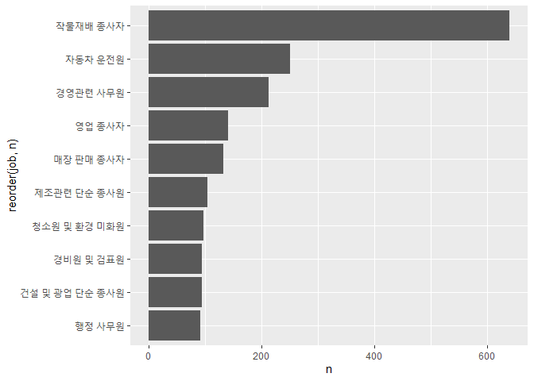
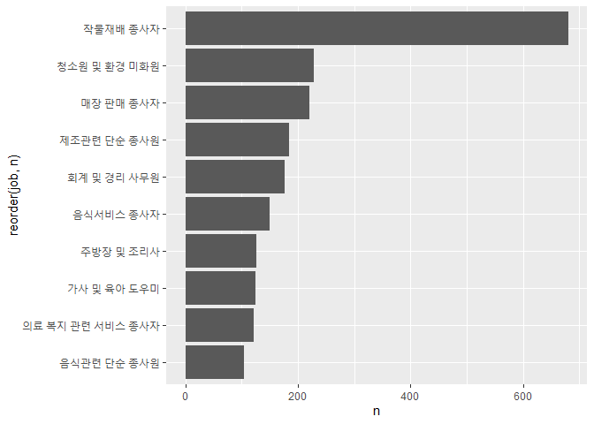

성별 직업 빈도
================
박세화
July 31, 2020

## 7\. 성별 직업 빈도

성별에 따라 어떤 직업에 많이 종사하고 있는지 분석한다.

### 분석 절차

  - 1단계 : 변수 검토 및 전처리 (성별, 직업)
  - 2단계 : 변수 간 상관 관계 분석 (성별 직업 빈도표 만들기, 그래프 만들기)

### 성별 직업 빈도 분석하기

#### 1\. 성별 직업 빈도표 만들기

각 성별로 직업별 빈도를 구해 상위 10개를 추출한다.

``` r
# 남성 직업 빈도 상위 10개 추출
job_male <- welfare %>% 
  filter(!is.na(job) & sex=="male") %>% 
  group_by(job) %>% 
  summarise(n=n()) %>% 
  arrange(desc(n)) %>% 
  head(10)
```

    ## `summarise()` ungrouping output (override with `.groups` argument)

``` r
job_male
```

    ## # A tibble: 10 x 2
    ##    job                          n
    ##    <chr>                    <int>
    ##  1 작물재배 종사자            640
    ##  2 자동차 운전원              251
    ##  3 경영관련 사무원            213
    ##  4 영업 종사자                141
    ##  5 매장 판매 종사자           132
    ##  6 제조관련 단순 종사원       104
    ##  7 청소원 및 환경 미화원       97
    ##  8 건설 및 광업 단순 종사원    95
    ##  9 경비원 및 검표원            95
    ## 10 행정 사무원                 92

``` r
# 여성 직업 빈도 상위 10개 추출
job_female <- welfare %>% 
  filter(!is.na(job) & sex=="female") %>% 
  group_by(job) %>% 
  summarise(n=n()) %>% 
  arrange(desc(n)) %>% 
  head(10)
```

    ## `summarise()` ungrouping output (override with `.groups` argument)

``` r
job_female
```

    ## # A tibble: 10 x 2
    ##    job                              n
    ##    <chr>                        <int>
    ##  1 작물재배 종사자                680
    ##  2 청소원 및 환경 미화원          228
    ##  3 매장 판매 종사자               221
    ##  4 제조관련 단순 종사원           185
    ##  5 회계 및 경리 사무원            176
    ##  6 음식서비스 종사자              149
    ##  7 주방장 및 조리사               126
    ##  8 가사 및 육아 도우미            125
    ##  9 의료 복지 관련 서비스 종사자   121
    ## 10 음식관련 단순 종사원           104

#### 2\. 그래프 만들기

성별 직업 빈도표를 이용하여 그래프를 만든다. 직업 명칭이 길기 때문에 직업 명칭을 모두 볼 수 있도록 90도 회전시킨 그래프를
만든다.

``` r
# 남성 직업 빈도 상위 10개 직업
ggplot(data=job_male,aes(x=reorder(job,n),y=n))+
  geom_col()+
  coord_flip()
```

<!-- -->

``` r
# 여성 직업 빈도 상위 10개 직업
ggplot(data=job_female,aes(x=reorder(job,n),y=n))+
  geom_col()+
  coord_flip()
```

<!-- -->

표와 그래프를 통해 남성과 여성 모두 ‘작물 재배 종사자’에 가장 많이 종사하고 있는 것을 확인할 수 있으며, 남성은 640명
여성은 680명이 종사하고 있다. 남성의 경우 ’작물 재배 종사자’ 다음으로 많이 종사하는 직업은 ‘자동차 운전원’,
‘경영관련 사무원’ 순이며 각각 251명, 213명이 종사하고 있다. 여성의 경우 ’청소원 및 환경 미화원’이 두
번째로 많이 종사하고 있는 직업이며 228명이 종사하고 있고, ’매장 판매 종사자’가 세 번째로 많이 종사하고 있는
직업이며 221명이 종사하고 있다.
