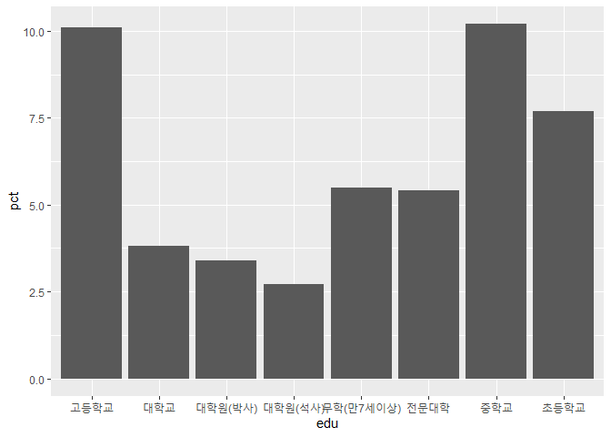
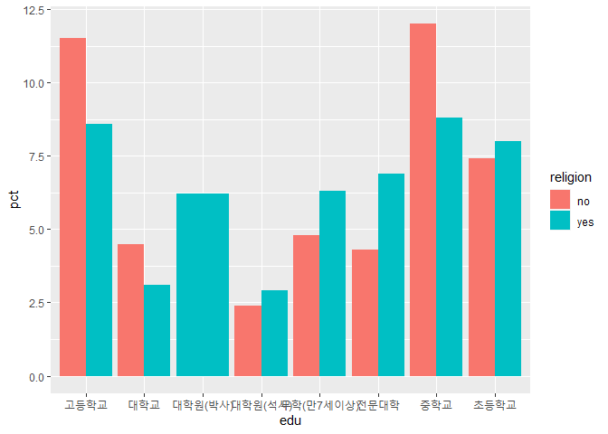

8-1. 교육수준에 따른 이혼율
================
박세화
July 31, 2020

## 8-1. 교육수준에 따른 이혼율

교육수준에 따라 사람들의 이혼율이 어떻게 다른지 분석해 보도록 한다. 먼저 교육수준, 혼인 상태 두 변수를 검토하고 전처리한 후
변수 간 관계를 분석한다.

### 분석 절차

  - 1단계: 변수 검토 및 전처리 (교육수준, 혼인 상태)
  - 2단계 : 변수 간 관계 분석 (교육수준에 따른 이혼율 표 만들기, 그래프 만들기)

### 교육수준 변수 검토 및 전처리하기

#### 1\. 변수 검토하기

``` r
class(welfare$code_edu)

table(welfare$code_edu)
```

#### 2\. 전처리

코딩북 목록을 이용해 교육수준 명칭으로 된 변수를 만든다. Koweps\_Codebook.xlsx의 ‘교육수준’ 시트에 정리된
교육수준코드를 불러오기 위해 readxl 패키지를 로드하고 첫 행을 변수명으로 가져오도록 설정하며, 엑셀 파일의 네 번째
시트에 있는 교육수준코드 목록을 불러오도록 sheet 파라미터에 4를 지정한다.

``` r
library(readxl)
list_edu <- read_excel("Koweps_Codebook.xlsx",col_names=T,sheet=4)

head(list_edu)
```

    ## # A tibble: 6 x 2
    ##   code_edu edu              
    ##      <dbl> <chr>            
    ## 1        1 미취학(만7세미만)
    ## 2        2 무학(만7세이상)  
    ## 3        3 초등학교         
    ## 4        4 중학교           
    ## 5        5 고등학교         
    ## 6        6 전문대학

``` r
dim(list_edu)
```

    ## [1] 9 2

3.  데이터 결합하기 left\_join()으로 edu 변수를 welfare에 결합한다. welfare와 list\_edu에
    공통으로 들어있는 code\_edu 변수를 기준으로 결합하면 된다.

<!-- end list -->

``` r
welfare <- left_join(welfare,list_edu,id="code_edu")
```

    ## Joining, by = "code_edu"

``` r
welfare %>% 
  filter(!is.na(code_edu)) %>% 
  select(code_edu,edu) %>% 
  head(10)
```

    ##    code_edu             edu
    ## 1         2 무학(만7세이상)
    ## 2         4          중학교
    ## 3         3        초등학교
    ## 4         7          대학교
    ## 5         2 무학(만7세이상)
    ## 6         6        전문대학
    ## 7         5        고등학교
    ## 8         3        초등학교
    ## 9         4          중학교
    ## 10        4          중학교

### 혼인 상태 변수 검토 및 전처리하기

#### 1\. 변수 검토하기

``` r
class(welfare$marriage)

table(welfare$marriage)
```

#### 2\. 파생변수 만들기

코드북의 혼인 상태 변수에 대한 정보를 확인하면 배우자가 있을 경우 1, 이혼했을 경우 3으로 코딩되어 있다. 이 값을 이용하여
이혼 여부를 나타내는 변수를 만든다.

``` r
# 이혼 여부 변수 만들기
welfare$group_marriage <- ifelse(welfare$marriage==1,"marriage",
                                 ifelse(welfare$marriage==3,"divorce",NA))

table(welfare$group_marriage)
```

    ## 
    ##  divorce marriage 
    ##      712     8431

``` r
table(is.na(welfare$group_marriage))
```

    ## 
    ## FALSE  TRUE 
    ##  9143  7521

``` r
qplot(welfare$group_marriage)
```

<!-- -->

표와그래프를 통해 결혼 상태인 사람은 8431명, 이혼한 사람은 712명, 둘 중 어디에도 속하지 않아 결측치로 분류된 사람이
7521명이라는 것을 알 수 있다. 결측치로 분류된 사람들은 이후 분석에서 제외한다.

### 교육수준에 따른 이혼율 분석하기

교육수준에 따른 이혼율 표를 만든다. 먼저 교육수준 및 결혼 상태별로 나눠 빈도를 구한 후 각 교육수준 집단의 전체 빈도로 나눠
비율을 구하도록 한다.

#### 1\. 교육수준에 따른 이혼율 표 만들기

``` r
edu_marriage <- welfare %>% 
  filter(!is.na(group_marriage)) %>% 
  group_by(edu,group_marriage) %>% 
  summarise(n=n()) %>% 
  mutate(tot_group=sum(n)) %>% 
  mutate(pct=round(n/tot_group*100,1))
```

    ## `summarise()` regrouping output by 'edu' (override with `.groups` argument)

``` r
edu_marriage
```

    ## # A tibble: 16 x 5
    ## # Groups:   edu [8]
    ##    edu             group_marriage     n tot_group   pct
    ##    <chr>           <chr>          <int>     <int> <dbl>
    ##  1 고등학교        divorce          307      3033  10.1
    ##  2 고등학교        marriage        2726      3033  89.9
    ##  3 대학교          divorce           57      1490   3.8
    ##  4 대학교          marriage        1433      1490  96.2
    ##  5 대학원(박사)    divorce            1        29   3.4
    ##  6 대학원(박사)    marriage          28        29  96.6
    ##  7 대학원(석사)    divorce            6       220   2.7
    ##  8 대학원(석사)    marriage         214       220  97.3
    ##  9 무학(만7세이상) divorce           24       437   5.5
    ## 10 무학(만7세이상) marriage         413       437  94.5
    ## 11 전문대학        divorce           43       795   5.4
    ## 12 전문대학        marriage         752       795  94.6
    ## 13 중학교          divorce          131      1283  10.2
    ## 14 중학교          marriage        1152      1283  89.8
    ## 15 초등학교        divorce          143      1856   7.7
    ## 16 초등학교        marriage        1713      1856  92.3

#### `count()` 활용

``` r
edu_marriage <- welfare %>% 
  filter(!is.na(group_marriage)) %>% 
  count(edu,group_marriage) %>% 
  group_by(edu) %>% 
  mutate(pct=round(n/sum(n)*100,1))
```

#### 2\. 연령대별 이혼율 그래프 만들기

``` r
# 미취학 제외, 이혼 추출
edu_divorce <- edu_marriage %>% 
  filter(edu !=1 & group_marriage=="divorce") %>% 
  select(edu,pct)

edu_divorce
```

    ## # A tibble: 8 x 2
    ## # Groups:   edu [8]
    ##   edu               pct
    ##   <chr>           <dbl>
    ## 1 고등학교         10.1
    ## 2 대학교            3.8
    ## 3 대학원(박사)      3.4
    ## 4 대학원(석사)      2.7
    ## 5 무학(만7세이상)   5.5
    ## 6 전문대학          5.4
    ## 7 중학교           10.2
    ## 8 초등학교          7.7

``` r
# 그래프 만들기
ggplot(data=edu_divorce,aes(x=edu,y=pct))+geom_col()
```

<!-- -->

분석 결과에 따르면 중학교와 고등학교 졸업 사람들이 10%를 상회하는 비율로 가장 이혼율이 높다는 것을 알 수 있다.

#### 3\. 교육수준 및 종교 유무에 따른 이혼율 표 만들기

종교 유무에 따른 이혼율 차이가 교육수준별로 다른지 알아본다. 먼저 교육수준, 종교 유무, 결혼 상태별로 집단을 나눠 빈도를 구한
후, 각 집단 전체 빈도로 나누어 비율을 구한다. 이후 이혼에 해당하는 값만 추출해 연령대 및 종교 유무별 이혼율 표를 만든다.

``` r
# 교육수준, 종교 유무, 결혼 상태별 비율표 만들기
edu_religion_marriage <- welfare %>% 
  filter(!is.na(group_marriage) & edu !=1) %>% 
  group_by(edu, religion, group_marriage) %>% 
  summarise(n=n()) %>% 
  mutate(tot_group=sum(n)) %>% 
  mutate(pct=round(n/tot_group*100,1))
```

    ## `summarise()` regrouping output by 'edu', 'religion' (override with `.groups` argument)

``` r
edu_religion_marriage
```

    ## # A tibble: 31 x 6
    ## # Groups:   edu, religion [16]
    ##    edu          religion group_marriage     n tot_group   pct
    ##    <chr>        <chr>    <chr>          <int>     <int> <dbl>
    ##  1 고등학교     no       divorce          181      1576  11.5
    ##  2 고등학교     no       marriage        1395      1576  88.5
    ##  3 고등학교     yes      divorce          126      1457   8.6
    ##  4 고등학교     yes      marriage        1331      1457  91.4
    ##  5 대학교       no       divorce           34       754   4.5
    ##  6 대학교       no       marriage         720       754  95.5
    ##  7 대학교       yes      divorce           23       736   3.1
    ##  8 대학교       yes      marriage         713       736  96.9
    ##  9 대학원(박사) no       marriage          13        13 100  
    ## 10 대학원(박사) yes      divorce            1        16   6.2
    ## # ... with 21 more rows

#### `count()` 활용

``` r
edu_religion_marriage <- welfare %>% 
  filter(!is.na(group_marriage) & edu !=1) %>% 
  count(edu,religion,group_marriage) %>% 
  group_by(edu,religion) %>% 
  mutate(pct=round(n/sum(n)*100,1))
```

#### 교육수준 및 종교 유무별 이혼율 표 만들기

``` r
df_divorce_2 <- edu_religion_marriage %>% 
  filter(group_marriage=="divorce") %>% 
  select(edu,religion,pct)

df_divorce_2
```

    ## # A tibble: 15 x 3
    ## # Groups:   edu, religion [15]
    ##    edu             religion   pct
    ##    <chr>           <chr>    <dbl>
    ##  1 고등학교        no        11.5
    ##  2 고등학교        yes        8.6
    ##  3 대학교          no         4.5
    ##  4 대학교          yes        3.1
    ##  5 대학원(박사)    yes        6.2
    ##  6 대학원(석사)    no         2.4
    ##  7 대학원(석사)    yes        2.9
    ##  8 무학(만7세이상) no         4.8
    ##  9 무학(만7세이상) yes        6.3
    ## 10 전문대학        no         4.3
    ## 11 전문대학        yes        6.9
    ## 12 중학교          no        12  
    ## 13 중학교          yes        8.8
    ## 14 초등학교        no         7.4
    ## 15 초등학교        yes        8

#### 4\. 교육수준 및 종교 유무에 따른 이혼율 그래프 만들기

``` r
ggplot(data=df_divorce_2,aes(x=edu,y=pct,fill=religion))+
  geom_col(position="dodge")
```

<!-- -->

표와 그래프를 통해 이혼율이 가장 높은 학력이 중학교와 고등학교 졸업인 사람들은 다른 학력의 사람들보다 종교를 갖고 있지 않은
비율이 더 높은 것을 알 수 있다. (대학교 졸업 제외) 또한 대학원(박사) 졸업자들은 모두 종교를 가지고 있다는 특이성을
발견할 수 있다.
