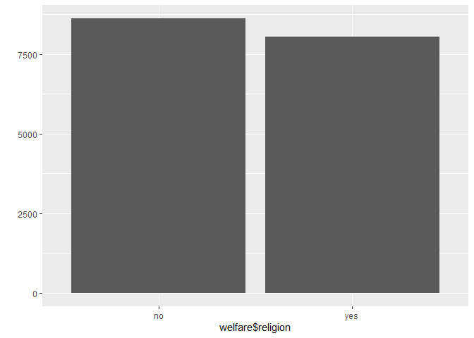
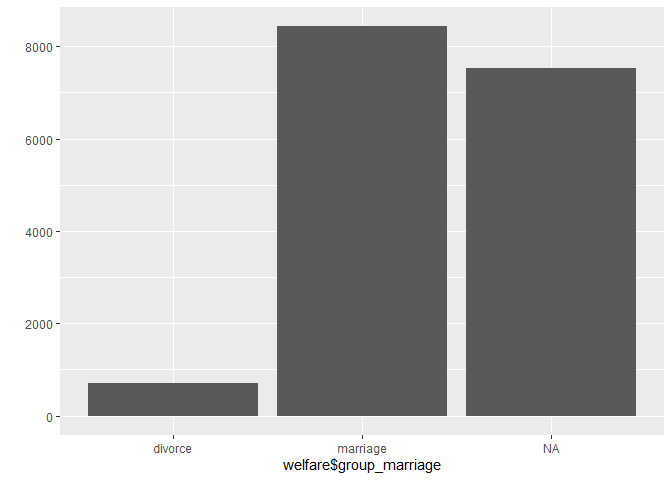
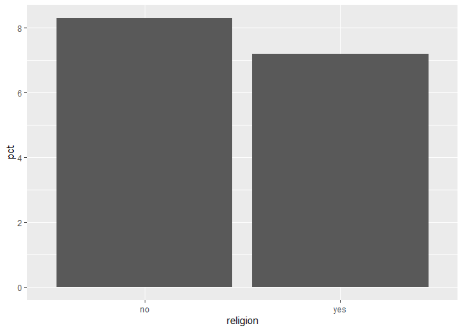
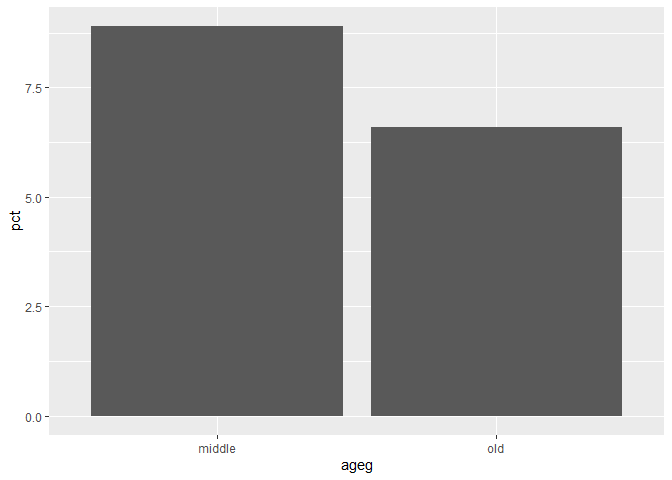

종교 유무에 따른 이혼율
================
박세화
July 31, 2020

## 8\. 종교 유무에 따른 이혼율

종교가 있는 사람들이 종교가 없는 사람들보다 이혼을 덜 하는지 분석해 보도록 한다. 먼저 종교, 혼인 상태 두 변수를 검토하고
전처리한 후 변수 간 관계를 분석한다.

### 분석 절차

  - 1단계: 변수 검토 및 전처리 (종교, 혼인 상태)
  - 2단계 : 변수 간 관계 분석 (종교 유무에 따른 이혼율 표 만들기, 그래프 만들기)

### 종교 변수 검토 및 전처리하기

#### 1\. 변수 검토하기

``` r
class(welfare$religion)

table(welfare$religion)
```

#### 2\. 전처리

코드북의 종교 변수에 대한 정보를 바탕으로 전처리를 한다. 변수 검토 과정을 통해 1과 2 외에 다른 값이 존재하지 않는다는 것을
파악할 수 있다. 값의 의미를 이해할 수 있도록 1과 2 대신 “yes”, “no”로 문자를 부여한다.

``` r
welfare$religion <- ifelse(welfare$religion==1,"yes","no")

table(welfare$religion)
```

    ## 
    ##   no  yes 
    ## 8617 8047

``` r
qplot(welfare$religion)
```

<!-- -->

### 혼인 상태 변수 검토 및 전처리하기

#### 1\. 변수 검토하기

``` r
class(welfare$marriage)

table(welfare$marriage)
```

#### 2\. 파생변수 만들기

코드북의 혼인 상태 변수에 대한 정보를 확인하면 배우자가 있을 경우 1, 이혼했을 경우 3으로 코딩되어 있다. 이 값을 이용하여
이혼 여부를 나타내는 변수를 만든다.

``` r
# 이혼 여부 변수 만들기
welfare$group_marriage <- ifelse(welfare$marriage==1,"marriage",
                                 ifelse(welfare$marriage==3,"divorce",NA))

table(welfare$group_marriage)
```

    ## 
    ##  divorce marriage 
    ##      712     8431

``` r
table(is.na(welfare$group_marriage))
```

    ## 
    ## FALSE  TRUE 
    ##  9143  7521

``` r
qplot(welfare$group_marriage)
```

<!-- -->

표와그래프를 통해 결혼 상태인 사람은 8431명, 이혼한 사람은 712명, 둘 중 어디에도 속하지 않아 결측치로 분류된 사람이
7521명이라는 것을 알 수 있다. 결측치로 분류된 사람들은 이후 분석에서 제외한다.

### 종교 유무에 따른 이혼율 분석하기

종교 유무에 따른 이혼율 표를 만든다. 먼저 종교 유무 및 결혼 상태별로 나눠 빈도를 구한 후 각 종교 유무 집단의 전체 빈도로
나눠 비율을 구하도록 한다.

#### 1\. 종교 유무에 따른 이혼율 표 만들기

``` r
religion_marriage <- welfare %>% 
  filter(!is.na(group_marriage)) %>% 
  group_by(religion,group_marriage) %>% 
  summarise(n=n()) %>% 
  mutate(tot_group=sum(n)) %>% 
  mutate(pct=round(n/tot_group*100,1))
```

    ## `summarise()` regrouping output by 'religion' (override with `.groups` argument)

``` r
religion_marriage
```

    ## # A tibble: 4 x 5
    ## # Groups:   religion [2]
    ##   religion group_marriage     n tot_group   pct
    ##   <chr>    <chr>          <int>     <int> <dbl>
    ## 1 no       divorce          384      4602   8.3
    ## 2 no       marriage        4218      4602  91.7
    ## 3 yes      divorce          328      4541   7.2
    ## 4 yes      marriage        4213      4541  92.8

#### `count()` 활용

``` r
religion_marriage <- welfare %>% 
  filter(!is.na(group_marriage)) %>% 
  count(religion,group_marriage) %>% 
  group_by(religion) %>% 
  mutate(pct=round(n/sum(n)*100,1))
```

#### 2\. 이혼율 표 만들기

위의 표에서 이혼에 해당하는 값만 추출해 이혼율 표를 만든다.

``` r
# 이혼 추출
divorce <- religion_marriage %>% 
  filter(group_marriage=="divorce") %>% 
  select(religion,pct)

divorce
```

    ## # A tibble: 2 x 2
    ## # Groups:   religion [2]
    ##   religion   pct
    ##   <chr>    <dbl>
    ## 1 no         8.3
    ## 2 yes        7.2

#### 3\. 그래프 만들기

이혼율 표를 이용해 그래프를 만든다.

``` r
ggplot(data=divorce,aes(x=religion,y=pct))+geom_col()
```

<!-- -->

이혼율은 종교가 있는 경우 7.2%, 종교가 없는 경우 8.3%로 나타났다. 따라서 종교가 있는 사람들 이혼을 비교적 덜 한다고
볼 수 있다.

### 연령대 및 종교 유무에 따른 이혼율 분석하기

종교 유무에 따른 이혼율이 연령대별로 다른지 알아본다.

#### 1\. 연령대별 이혼율 표 만들기

우선 이혼율이 연령대에 따라 다른지 알아본다. 연령대 및 결혼 상태별 비율표를 만든 다음, 이혼한 경우를 추출해 이혼율 표를
만든다.

``` r
ageg_marriage <- welfare %>% 
  filter(!is.na(group_marriage)) %>% 
  group_by(ageg,group_marriage) %>% 
  summarise(n=n()) %>% 
  mutate(tot_group=sum(n)) %>% 
  mutate(pct=round(n/tot_group*100,1))
```

    ## `summarise()` regrouping output by 'ageg' (override with `.groups` argument)

``` r
ageg_marriage
```

    ## # A tibble: 6 x 5
    ## # Groups:   ageg [3]
    ##   ageg   group_marriage     n tot_group   pct
    ##   <chr>  <chr>          <int>     <int> <dbl>
    ## 1 middle divorce          437      4918   8.9
    ## 2 middle marriage        4481      4918  91.1
    ## 3 old    divorce          273      4165   6.6
    ## 4 old    marriage        3892      4165  93.4
    ## 5 young  divorce            2        60   3.3
    ## 6 young  marriage          58        60  96.7

#### `count()` 활용

``` r
ageg_marriage <- welfare %>% 
  filter(!is.na(group_marriage)) %>% 
  count(ageg,group_marriage) %>% 
  group_by(ageg) %>% 
  mutate(pct=round(n/sum(n)*100,1))
```

표를 통해 연령대별로 이혼율이 다르다는 것을 알 수 있다. 초년의 경우는 결혼하거나 이혼한 사례가 절대적으로 적다는 것을 알 수
있다. 초년은 사례가 부족해 비교에 적합하지 않으므로 이후 분석 작업에서 제외하도록 한다.

#### 2\. 연령대별 이혼율 그래프 만들기

``` r
# 초년 제외, 이혼 추출
ageg_divorce <- ageg_marriage %>% 
  filter(ageg !="young" & group_marriage=="divorce") %>% 
  select(ageg,pct)

ageg_divorce
```

    ## # A tibble: 2 x 2
    ## # Groups:   ageg [2]
    ##   ageg     pct
    ##   <chr>  <dbl>
    ## 1 middle   8.9
    ## 2 old      6.6

``` r
# 그래프 만들기
ggplot(data=ageg_divorce,aes(x=ageg,y=pct))+geom_col()
```

<!-- -->

#### 3\. 연령대 및 종교 유무에 따른 이혼율 표 만들기

종교 유무에 따른 이혼율 차이가 연령대별로 다른지 알아본다. 먼저 연령대, 종교 유무, 결혼 상태별로 집단을 나눠 빈도를 구한
후, 각 집단 전체 빈도로 나누어 비율을 구한다. 이후 이혼에 해당하는 값만 추출해 연령대 및 종교 유무별 이혼율 표를
만든다.

``` r
# 연령대, 종교 유무, 결혼 상태별 비율표 만들기
ageg_religion_marriage <- welfare %>% 
  filter(!is.na(group_marriage) & ageg !="young") %>% 
  group_by(ageg, religion, group_marriage) %>% 
  summarise(n=n()) %>% 
  mutate(tot_group=sum(n)) %>% 
  mutate(pct=round(n/tot_group*100,1))
```

    ## `summarise()` regrouping output by 'ageg', 'religion' (override with `.groups` argument)

``` r
ageg_religion_marriage
```

    ## # A tibble: 8 x 6
    ## # Groups:   ageg, religion [4]
    ##   ageg   religion group_marriage     n tot_group   pct
    ##   <chr>  <chr>    <chr>          <int>     <int> <dbl>
    ## 1 middle no       divorce          260      2681   9.7
    ## 2 middle no       marriage        2421      2681  90.3
    ## 3 middle yes      divorce          177      2237   7.9
    ## 4 middle yes      marriage        2060      2237  92.1
    ## 5 old    no       divorce          123      1884   6.5
    ## 6 old    no       marriage        1761      1884  93.5
    ## 7 old    yes      divorce          150      2281   6.6
    ## 8 old    yes      marriage        2131      2281  93.4

#### `count()` 활용

#### 연령대 및 종교 유무별 이혼율 표 만들기

#### 4\. 연령대 및 종교 유무에 따른 이혼율 그래프 만들기
