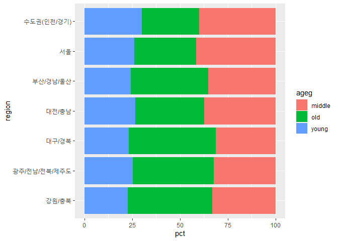
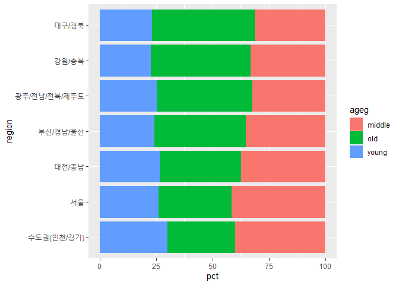
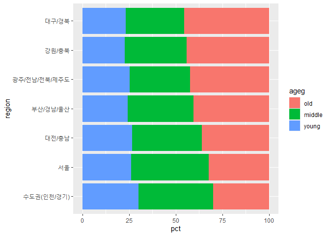

지역별 연령대 비율
================
작성자
July 31, 2020

## 9\. 지역별 연령대 비율

지역별 연령대 비율을 분석해 노년층이 많은 지역이 어디인지 알아보고, 분석 결과를 통해 노인들을 위한 시설을 마련하는데 활용할 수
있도록 한다. 연령대 변수 전처리는 앞에서 완료했으므로 건너뛰고, 지역 변수를 검토하고 전처리한 후, 변수 간 관계를 분석한다.

### 분석 절차

  - 1단계 : 변수 검토 및 전처리 (지역, 연령대)
  - 2단계 : 변수 간 관계 분석 (지역별 연령대 비율표 만들기, 그래프 만들기)

### 지역 변수 검토 및 전처리하기

#### 1\. 변수 검토하기

``` r
class(welfare$code_region)

table(welfare$code_region)
```

#### 2\. 전처리

코드북의 내용을 참조해 지역 코드 목록을 만든 후, 지역 코드 목록과 welfare에 동시에 들어 있는 code\_region
변수를 이용해 welfare에 지역명 변수를 추가한다.

``` r
list_region <- data.frame(code_region=c(1:7),
                          region=c("서울",
                                   "수도권(인천/경기)",
                                   "부산/경남/울산",
                                   "대구/경북",
                                   "대전/충남",
                                   "강원/충북",
                                   "광주/전남/전북/제주도"))

list_region
```

    ##   code_region                region
    ## 1           1                  서울
    ## 2           2     수도권(인천/경기)
    ## 3           3        부산/경남/울산
    ## 4           4             대구/경북
    ## 5           5             대전/충남
    ## 6           6             강원/충북
    ## 7           7 광주/전남/전북/제주도

#### `welfare`에 지역명 변수 추가

``` r
welfare <- left_join(welfare,list_region,id="code_region")
```

    ## Joining, by = "code_region"

``` r
welfare %>% 
  select(code_region,region) %>% 
  head
```

### 지역별 연령대 비율 분석하기

#### 1\. 지역별 연령대 비율표 만들기

지역 및 연령대별로 나눠 빈도를 구한 뒤, 각 지역의 전체 빈도로 나눠 비율을 구해 지역별 연령대 비율표를 만든다.

``` r
region_ageg <- welfare %>% 
  group_by(region,ageg) %>% 
  summarise(n=n()) %>% 
  mutate(tot_group=sum(n)) %>% 
  mutate(pct=round(n/tot_group*100,2))
```

    ## `summarise()` regrouping output by 'region' (override with `.groups` argument)

``` r
head(region_ageg)
```

    ## # A tibble: 6 x 5
    ## # Groups:   region [2]
    ##   region                ageg       n tot_group   pct
    ##   <chr>                 <chr>  <int>     <int> <dbl>
    ## 1 강원/충북             middle   417      1257  33.2
    ## 2 강원/충북             old      555      1257  44.2
    ## 3 강원/충북             young    285      1257  22.7
    ## 4 광주/전남/전북/제주도 middle   947      2922  32.4
    ## 5 광주/전남/전북/제주도 old     1233      2922  42.2
    ## 6 광주/전남/전북/제주도 young    742      2922  25.4

#### `count()` 활용

``` r
region_ageg <- welfare %>% 
  count(region,ageg) %>% 
  group_by(region) %>% 
  mutate(pct=round(n/sum(n)*100,2))
```

#### 2\. 그래프 만들기

표를 이용해 그래프를 만든다. 연령대 비율 막대를 서로 다른 색으로 표현하도록 aes의 fill 파라미터에 ageg를 지정한다.
지역별로 비교하기 쉽도록 coord\_flip()을 추가해서 그래프를 오른쪽으로 회전한다.

``` r
ggplot(data=region_ageg,aes(x=region,y=pct,fill=ageg))+
  geom_col()+
  coord_flip()
```

<!-- -->

#### 3\. 막대 정렬하기 : 노년층 비율 높은 순

``` r
# 노년층 비율 내림차순 정렬
list_order_old <- region_ageg %>% 
  filter(ageg=="old") %>% 
  arrange(pct)

list_order_old
```

    ## # A tibble: 7 x 4
    ## # Groups:   region [7]
    ##   region                ageg      n   pct
    ##   <chr>                 <chr> <int> <dbl>
    ## 1 수도권(인천/경기)     old    1109  29.9
    ## 2 서울                  old     805  32.4
    ## 3 대전/충남             old     527  35.9
    ## 4 부산/경남/울산        old    1124  40.4
    ## 5 광주/전남/전북/제주도 old    1233  42.2
    ## 6 강원/충북             old     555  44.2
    ## 7 대구/경북             old     928  45.6

``` r
# 지역명 순서 변수 만들기
order <- list_order_old$region
order
```

    ## [1] "수도권(인천/경기)"     "서울"                  "대전/충남"            
    ## [4] "부산/경남/울산"        "광주/전남/전북/제주도" "강원/충북"            
    ## [7] "대구/경북"

``` r
ggplot(data=region_ageg,aes(x=region,y=pct,fill=ageg))+
  geom_col()+
  coord_flip()+
  scale_x_discrete(limits=order)
```

<!-- -->

#### 4\. 연령대 순으로 막대 색깔 나열하기

초년, 중년, 노년의 연령대 순으로 나열되도록 설정한다.

``` r
class(region_ageg$ageg)
```

    ## [1] "character"

``` r
levels(region_ageg$ageg)
```

    ## NULL

``` r
region_ageg$ageg <- factor(region_ageg$ageg,
                           level=c("old","middle","young"))

class(region_ageg$ageg)
```

    ## [1] "factor"

``` r
levels(region_ageg$ageg)
```

    ## [1] "old"    "middle" "young"

``` r
ggplot(data=region_ageg,aes(x=region,y=pct,fill=ageg))+
  geom_col()+
  coord_flip()+
  scale_x_discrete(limits=order)
```

<!-- -->

출력된 그래프를 통해 노년층 비율이 대구/경북, 강원/충북, 광주/전남/전북/제주도 순으로 높다는 것을 알 수 있다.
